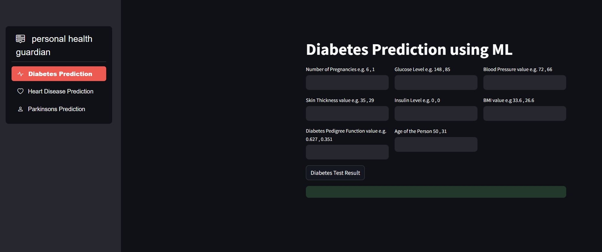
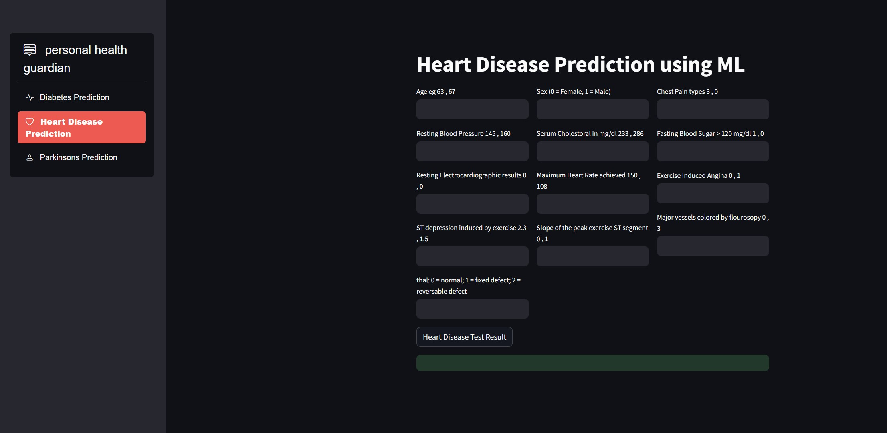
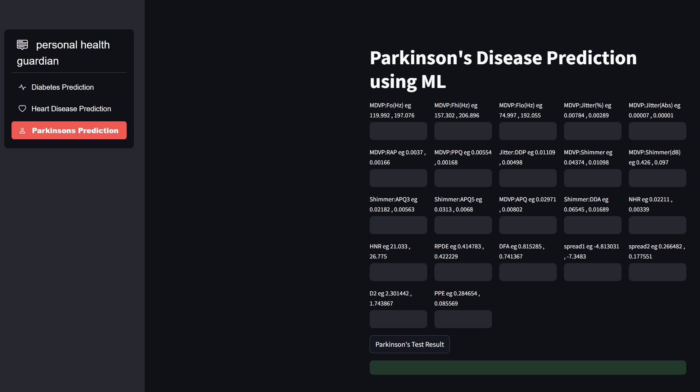

# 🩺 Multiple Disease Prediction System (Personal Health Guardian)

## 🚀 Project Overview

This repository contains **Personal Health Guardian**, a user-friendly web application developed using **Streamlit**, which predicts the presence of **Diabetes**, **Heart Disease**, and **Parkinson’s Disease** using machine learning models. This tool aims to provide early, accessible insights for individuals and support better health awareness and decision-making.

## 🎯 Key Objectives

- Predict the likelihood of multiple diseases based on user input data.
- Leverage trained machine learning models for real-time diagnosis.
- Provide a clean and intuitive interface for non-technical users.

## 🧠 Diseases Supported

1. **Diabetes** — Trained using **Support Vector Machine (SVM)**
2. **Heart Disease** — Trained using **Logistic Regression**
3. **Parkinson's Disease** — Trained using **Support Vector Machine (SVM)**

## 🛠️ Technologies & Libraries Used

| Technology         | Purpose                                      |
|--------------------|----------------------------------------------|
| Python             | Backend logic and data handling              |
| Streamlit          | Web application framework                    |
| Scikit-learn       | Machine learning modeling                    |
| Pickle / pickle5   | Model serialization/deserialization          |
| Pandas             | Data preprocessing and manipulation          |
| Streamlit Option Menu | For sidebar-based navigation              |


## Screenshots


Diabetes Output


Heart Output


Parkinson's Output

### 🧬 System Workflow

1. **Data Acquisition**: Load structured medical datasets for each disease.
2. **Preprocessing**: Clean, normalize, and prepare the datasets.
3. **Feature Selection**: Extract the most relevant predictors.
4. **Model Training**: Apply ML models with an 80/20 train-test split.
5. **Model Saving**: Save trained models using `pickle`.
6. **App Deployment**: Use Streamlit to build a multi-tab UI that takes inputs and returns predictions.

## 📂 Project Structure

```
├── personal_health_guardian.py        # Streamlit app file
├── requirements.txt                   # Python dependencies
├── saved models/                      # Serialized model files (.sav)
│   ├── diabetes_model.sav
│   ├── heart_disease_model.sav
│   └── parkinsons_model.sav
├── Screenshot/                        # Output screenshots
│   ├── Diabetes.jpg
│   ├── Heart.jpg
│   └── Parkinsons.jpg
└── README.md                          # Project documentation
```

## 📦 requirements.txt

```
streamlit
pickle5
streamlit-option-menu
scikit-learn
```

Alternatively, you can install them manually:
```bash
pip install streamlit pickle5 streamlit-option-menu scikit-learn
```